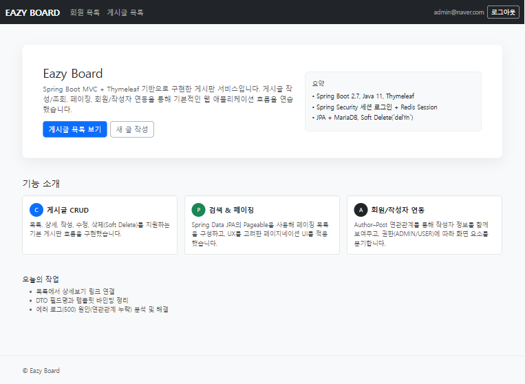
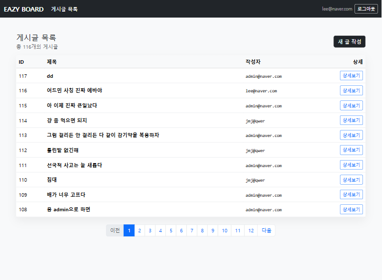
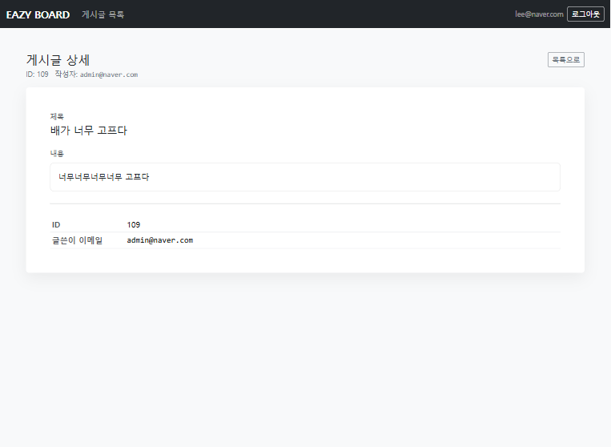
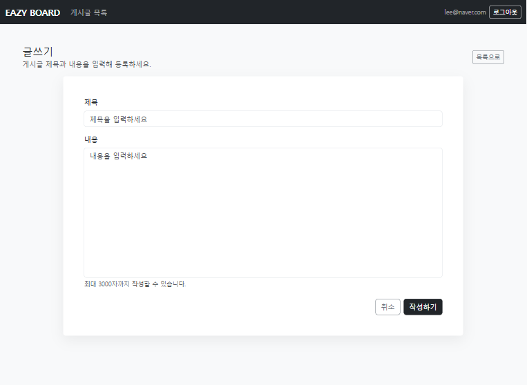
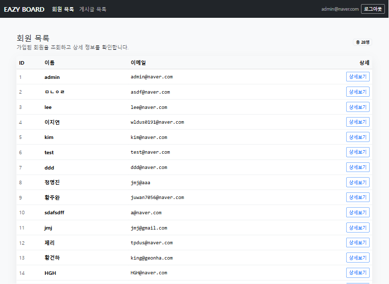
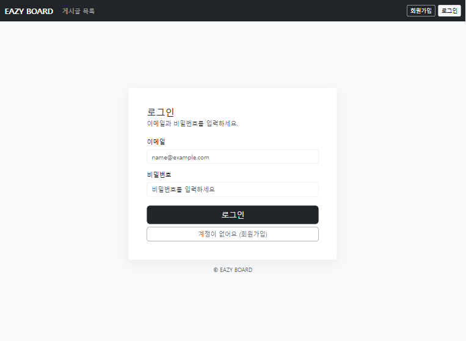

# BOARD SERVICE(Spring MVC Board)

Spring Boot MVC + Thymeleaf로 구현한 게시판 서비스입니다. Spring Security의 **세션 기반 인증**을 적용했고, Spring Session + Redis로 세션 저장소를 분리해 확장 가능한 구조로 구성했습니다.

## Demo
- Local: `http://localhost:8080`

## Features
- 게시글
    - 목록 조회 + 페이징
    - 상세 조회
    - 작성/수정
    - 삭제: Soft Delete(`delYn` 플래그 기반)
- 회원
    - 회원가입
    - 로그인/로그아웃
    - 회원 목록 조회
- 권한/접근 제어
    - ADMIN만 “회원가입” 메뉴 노출(화면 레벨)
    - 게시글 작성은 로그인 사용자만 가능(서버 접근 제어 포함)

## Tech Stack
- Language: Java 11
- Framework: Spring Boot 2.7.11 (Spring MVC)
- View: Thymeleaf + Bootstrap
- ORM: Spring Data JPA (Hibernate)
- DB: MariaDB
- Auth: Spring Security (Form Login / Session 기반)
- Session Store: Redis + Spring Session (`spring-session-data-redis`)
- Validation: Bean Validation (`spring-boot-starter-validation`)
- Etc: Lombok

## Architecture
- Presentation Layer: Controller (MVC) → Thymeleaf View
- Business Layer: Service (트랜잭션/비즈니스 규칙)
- Data Layer: Repository (Spring Data JPA)
- DTO → Entity 변환을 통해 “요청/화면 데이터”와 “영속 엔티티”를 분리했습니다.

## Authentication & Session (Redis)
- Spring Security는 인증 정보를 `SecurityContext`로 관리하고, 일반적인 구성에서는 이를 `HttpSession`에 저장합니다.
- 본 프로젝트는 Spring Session을 적용해 HTTP 세션을 **Redis에 저장**하도록 구성했습니다(즉, 인증 세션이 Redis에 저장되어 서버 인스턴스가 늘어나도 세션을 공유할 수 있는 형태).

## Data Model (요약)
- `Author` (회원) 1 : N `Post` (게시글)
- `Post.author_id`는 NOT NULL이며, 게시글 저장 시 작성자 연관관계 세팅이 필수입니다.
- 삭제는 hard delete가 아니라 `delYn = "YES"`로 처리하는 soft delete 정책을 사용합니다.

## Getting Started

### Prerequisites
- Java 11
- MariaDB (DB: `board`)
- Redis (default: `localhost:6379`)

### Configuration (`application.yml`)
```yml
server:
  port: 8080

spring:
  datasource:
    driver-class-name: org.mariadb.jdbc.Driver
    url: jdbc:mariadb://localhost:3306/board
    username: <YOUR_USERNAME>
    password: <YOUR_PASSWORD>

  redis:
    host: localhost
    port: 6379

  jpa:
    database-platform: org.hibernate.dialect.MariaDBDialect
    hibernate:
      ddl-auto: update
    show_sql: true
```

### Run
```bash
./gradlew bootRun
```

## Screens

### Home
- 프로젝트 소개/기능 요약 + 주요 CTA(게시글 목록/새 글 작성)
- 로그인 상태에 따라 헤더 메뉴가 분기됨

**로그인 전(일반 사용자)**


**로그인 후(ADMIN)**


---

### Posts (게시글)
- 게시글 CRUD 흐름: 목록 → 상세 → 작성

**게시글 목록 (페이징)**


**게시글 상세**


**게시글 작성**


---

### Authors (회원/관리자)
- ADMIN 권한에서 회원 목록/상세 확인 가능
- 회원가입/로그인 화면 제공

**회원 목록**


**회원 상세**


**회원 가입**


**로그인**


## Troubleshooting / Learned

### 1) `author_id` NOT NULL 제약 오류
게시글 저장 시 `author_id`가 null로 INSERT되면 DB에서 무결성 제약조건 위반으로 실패합니다. DTO → Entity 변환 단계에서 `Post.author` 연관관계를 누락하지 않도록 `.author(author)` 세팅을 보장하는 방식으로 해결했습니다.

### 2) 세션 저장소 분리의 의미
서버 메모리 세션에 의존하지 않고 Redis에 세션을 저장하도록 구성해, 다중 서버 환경에서도 로그인 세션을 공유할 수 있는 구조로 확장 가능성을 확보했습니다.

## Roadmap
- 검색 조건(카테고리/키워드) 고도화 + 페이징 UX 개선
- 관리자 기능 확장(회원 권한 관리, 게시글 관리)
- 테스트 코드 보강(서비스/리포지토리 계층)
